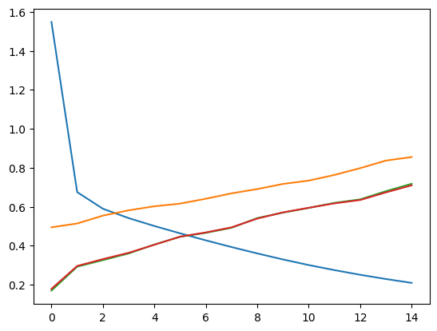
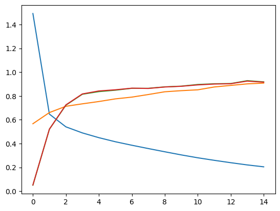

# Fine tunig hugingface models

## Fine tuning on parallel data

First we fine tune the model with the limited paralel data we have.
In this case we are traning two separate models, one for translating from negative to positive and one for translating from positive to negative.

- Negative to positive

- Positive to negative

## Using reinforcement learning to improve the model further

Fine tuning already improved the model a lot, but we can still improve it further by using reinforcement learning.
We use the fine tuned model to generate translations for the test set and then use the BLEU score to calculate the reward. Also inside the reward function we check if the output has correct sentiment. If it does not we give a negative reward. We then use the reward to train the model further.
